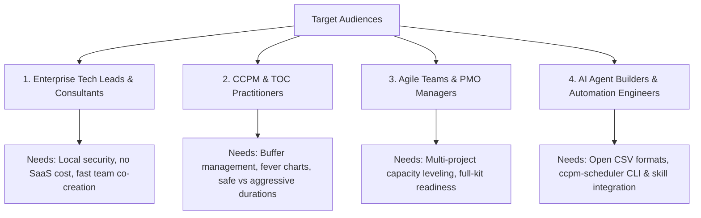
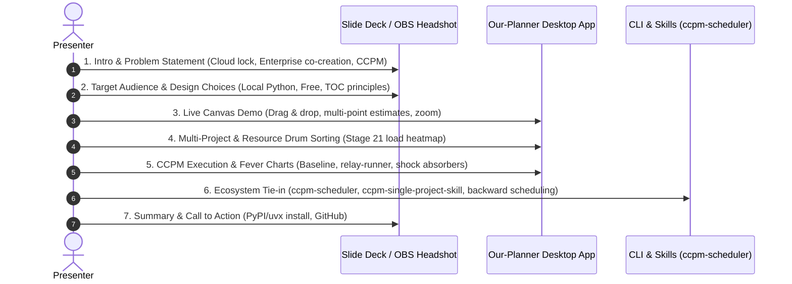

# Our-Planner: Comprehensive Feature Summary & Target Audience Analysis

> **Purpose**: Preparation document for the OBS/YouTube video demo of `our-planner`, covering feature capability inventory, design context, target audience profiling, and alignment with the CCPM ecosystem (`ccpm-scheduler`, `ccpm-single-project-skill`, and backward scheduling skills).

---

## Part 1: Comprehensive Feature Summary of `our-planner`

`our-planner` is an open-source, enterprise-friendly, local desktop planning application built in Python/Tkinter. It bridges the gap between collaborative digital whiteboards (like Miro/Mural) and formal project scheduling engines (like MS Project or Critical Chain tools), prioritizing real-time interactive team co-creation, privacy, and resource-aware timeline management.

---

### 1. Interactive Visual Planning Canvas (Grid & Timeline)
* **Direct Manipulative Canvas**:
  * Click-and-drag task creation on the grid.
  * Drag tasks to reposition in time or change assignment rows.
  * Left and right edge handle dragging for interactive duration adjustment (left-edge resize locks end date; right-edge resize adjusts finish date).
* **Dynamic Zoom Engine**:
  * Smooth zooming (`Ctrl + Mouse Wheel`, `Ctrl+Plus`, `Ctrl+Minus`, `Ctrl+0`) to transition seamlessly from high-level multi-month roadmap overviews down to granular daily execution view.
* **Visual Dependency Management**:
  * Drag-and-drop connector handles to wire dependencies directly on canvas.
  * Right-click context menus on dependency arrows to modify link type (`FS`, `SS`, `FF`, `SF`, `PB`, `FB`), set lag/lead times, or delete connections.
  * Visual differentiation: Critical chain/standard links drawn as solid arrows; Project & Feeding Buffer (`PB`/`FB`) links rendered as dashed lines both on canvas and in high-res PNG exports.
* **Selection & Bulk Actions**:
  * Marquee box selection (click-drag bounding box across grid), `Shift + Click`, and `Ctrl + A` (select all visible tasks).
  * Bulk operations: Move, delete, tag, change task states, update remaining durations, or apply bulk notes.
* **Keyboard-First & Ergonomic Design**:
  * Complete keyboard accessibility: `Alt+F`, `Alt+E`, `Alt+T`, `Alt+I`, `Alt+P`, `Alt+R`, `Alt+C`, `Alt+N`, `Alt+H` for instant menu access.
  * Keyboard dialogs: "Select Task by ID..." (`Ctrl+Shift+F`), quick note entry (`Alt+S` save, `Alt+C` cancel while typing).
  * Multi-monitor awareness: Context menus clamp cleanly to physical monitor bounds (xrandr aware on X11) to prevent running off-screen.

---

### 2. Task Estimation & Execution Tracking
* **Multi-Point Estimating (Safe vs. Aggressive)**:
  * Dual estimation inputs per task: **Safe Duration** (traditional estimate with embedded padding) vs. **Aggressive/Optimistic Duration** (50% rule / baseline estimate without safety).
* **Task State Pipeline**:
  * Three visual states: `planning` (standard task styling), `buffered` (grey background for buffer management), and `done` (green background for completed work).
* **Live Execution Metrics**:
  * `remaining_duration` tracking for live progress updates (automatically adjusts finish dates and pushes dependent successors).
  * Audit log of estimates: `remaining_duration_history` to track estimate accuracy over time.
  * Timestamps captured for `actual_start_date`, `actual_end_date`, and `fullkit_date`.
* **Contextual Timestamped Task Notes**:
  * Integrated right-side sliding panel for task notes.
  * Context-aware: displays notes for currently selected task(s), or displays all project notes when no tasks are selected.

---

### 3. Resource & Capacity Management
* **Multi-Resource Allocation**:
  * Assign multiple resources to a single task with custom allocation ratios (e.g. `5:2;7` allocates 2 units of Resource 5 and 1 unit of Resource 7).
* **Per-Day Utilization & Loading Heatmap**:
  * Live loading panel underneath the main task grid showing per-day resource utilization.
  * Heatmap coloring highlights optimal allocation vs over-allocated days instantly as tasks move.
* **Advanced Resource Controls & Filtering (Stage 21)**:
  * Resource IDs displayed directly on row labels.
  * Resource sorting: Sort by ID, Name, or Whole-Horizon Loading % (automatically floats drum/bottleneck resources to the top).
  * Resource filtering: Filter by project association or tag.
  * Load scope toggle: Calculate capacity/loading across all canvas tasks vs currently filtered project tasks.

---

### 4. Critical Chain Project Management (CCPM) & Buffer Management
* **Rolling-Wave & Multi-Project Canvas**:
  * Support for multiple independent projects co-existing on a single canvas sharing a single resource pool.
  * Project phase management: Independent `planning` vs `execution` phase toggling per project.
* **Advanced Link Types & Buffer Support**:
  * Supports `FS` (Finish-to-Start), `SS` (Start-to-Start), `FF` (Finish-to-Finish), `SF` (Start-to-Finish) with custom lag/lead.
  * Dedicated link types: `PB` (Project Buffer link) and `FB` (Feeding Buffer link).
  * Dedicated task types: `project_buffer` and `feeding_buffer`.
* **Execution Dynamics & Relay-Runner Shock Absorbers**:
  * *Planning Phase*: Auto-scheduling toggle enables optional forward dependency cascading.
  * *Execution Phase*: Mandatory relay-runner cascade. Two-sided shock absorber logic for feeding buffers: buffer compresses when merge points pull earlier (`merge_pulled_earlier`), regrows when merge points push later (`merge_moved_later`).
* **Project Baseline Capture**:
  * Snapshot project state (`col`, `duration`, `safe_duration`, timestamp) on transitioning from `planning` to `execution`.
* **Per-Project Selectable Buffer Sizing**:
  * Configurable buffer sizing algorithms per project: `cap` (Cut & Paste safety removal), `hchain` (50% chain length), or `rsem` (Root-Squared Error Method).
* **CCPM Engine Round-Trip Integration**:
  * Direct integration with `ccpm-scheduler` engine: `Network → Schedule with CCPM...`, `Network → Import CCPM Schedule...`, `Network → Export CCPM Network...`.

---

### 5. Reporting, Diagnostics & Visual Analytics
* **Fever Chart Reporting & Export**:
  * Tracks buffer consumption % vs project completion % across Red, Yellow, and Green risk zones.
  * Interactive fever chart viewer, high-res PNG export, and detailed CSV time-series data export.
* **Full-Kit Readiness Diagnostics**:
  * Dedicated report auditing whether prerequisite tasks, inputs, equipment, or full-kit dates are satisfied before work commences.
* **Network Graph Visualization**:
  * Renders dependency graph diagrams for any selected subset of tasks to inspect network logic.
* **Critical Path / Critical Chain Analysis**:
  * Visual highlights and reporting for critical path tasks.

---

### 6. Export & Data Exchange Capabilities
* **Multi-Format Exports**:
  * CSV Export: Generates structured `_tasks.csv`, `_resources.csv`, and `_resource_loading.csv` aligned with standard data schemas.
  * Graphic Exports: Export high-resolution PNG canvas graphics (with custom dash patterns for buffers) and PDF documents.
  * Web Export: Self-contained HTML interactive report view.
* **CCPM Network Package Export**:
  * Generates standard CCPM network bundle (`tasks.csv`, `resources.csv`, `calendar.csv`, `notes.txt`) compatible with external CCPM tools and AI agent skills.

---

### 7. Architectural & Design Philosophy ("Why `our-planner`?")
* **100% Local & Secure**: Zero cloud dependency. Sensitive enterprise project data and resource allocations stay strictly local on the user's desktop.
* **Open Source & Enterprise Built**: Standard Python code (hosted on GitHub, distributed on PyPI and `uvx`) allowing enterprise security auditability without licensing overhead.
* **Colleague Co-Creation**: Designed specifically for live, real-time planning workshops where teams adjust tasks and see resource impact instantly, bridging digital whiteboards and formal scheduling engines.

---

## Part 2: Target Audience Profiling, Needs & Problem Alignment

To structure a compelling video demo, we categorize our primary target audiences, outline their specific pain points, and map how `our-planner` directly solves their needs.

---

### Audience Profile 1: Enterprise Engineering Leads, Project Managers & Consultants

#### Profile & Context
* Managing complex tech, infrastructure, software, or business transformation initiatives inside enterprise environments (financial services, healthcare, defense, large corporate).
* Often running live planning workshops with cross-functional engineering teams.

#### Problems & Pain Points
1. **Cloud & Compliance Barriers**: Standard SaaS tools (Miro, Asana, Monday, SaaS Gantt tools) are often blocked by corporate security, or require multi-month security review.
2. **Licensing Friction**: Cannot buy software licenses for every engineer/stakeholder participating in a 2-hour planning workshop.
3. **Whiteboard-to-Schedule Disconnect**: Digital whiteboards (Miro/Mural) are great for sticky notes, but fail when leadership asks, *"When will this actually finish given our 6 engineers?"* Manual translation into MS Project is painful and quickly gets out of date.
4. **Heavyweight Tool Overhead**: Enterprise tools (MS Project, Primavera, Jira Advanced Roadmaps) are rigid, slow during live workshops, and demoralize team engagement.

#### How `our-planner` Solves Their Needs
* **Zero-Friction Local Execution**: Runs locally via standard Python (`uvx our-planner` or PyPI). Data never leaves the machine. Open-source MIT code passes security inspection easily.
* **Instant Co-Creation**: Drag-and-drop timeline grid with live resource heatmaps allows teams to brainstorm dependencies and immediately see completion dates in the room.
* **Zero License Cost**: Free to use with any team, client, or contractor organization.

---

### Audience Profile 2: Critical Chain (CCPM) & Theory of Constraints (TOC) Practitioners

#### Profile & Context
* Project management professionals trained in Goldratt's Critical Chain Project Management (CCPM) or Theory of Constraints (TOC).
* Operating in engineering, manufacturing, construction, R&D, or software delivery.

#### Problems & Pain Points
1. **Traditional Gantt Flaws**: Traditional tools encourage padding every single task. Parkinson's Law ("work expands to fill time") and Student Syndrome waste hidden task safety.
2. **Lack of Native CCPM Support**: Mainstream tools lack dual duration inputs (safe vs aggressive), project/feeding buffers, and dynamic fever chart reporting.
3. **Expensive Proprietary CCPM Software**: Dedicated CCPM software packages are often legacy, expensive, and closed desktop systems.

#### How `our-planner` Solves Their Needs
* **Native CCPM Mechanics**: Built from the ground up to support Safe vs. Aggressive durations, explicit `project_buffer` and `feeding_buffer` tasks, and dashed buffer link types (`PB`/`FB`).
* **Dynamic Fever Charts**: Built-in fever chart generator with Red/Yellow/Green safety zones, live execution monitoring, and CSV time-series exports.
* **Advanced Buffer Behaviors**: Two-sided shock absorber logic for feeding buffers during execution (`merge_pulled_earlier` / `merge_moved_later`) and configurable buffer sizing (`cap`, `hchain`, `rsem`).

---

### Audience Profile 3: Agile Team Leads, Scrum Masters & PMO Officers (Rolling-Wave & Multi-Project Planning)

#### Profile & Context
* Managing cross-functional delivery teams working across multiple concurrent projects or product streams.
* Practicing rolling-wave planning where near-term tasks are granular and long-term tasks are high-level.

#### Problems & Pain Points
1. **Resource Over-Allocation across Projects**: Individual team boards (Jira/Trello) don't show when specialist resources (e.g. Senior DBA, Architect, Lead Tester) are over-committed across 3 different projects.
2. **Bad Starts / Premature Execution**: Work starts before prerequisites (design, environments, access, full kit) are ready, causing high cycle times and multitasking.

#### How `our-planner` Solves Their Needs
* **Multi-Project Canvas with Shared Resource Pool**: Model multiple projects side-by-side on one timeline while sharing team capacity.
* **Stage 21 Resource Horizon Controls**: Sort resources by whole-horizon loading % so bottleneck ("drum") resources instantly float to the top of the grid.
* **Full-Kit Readiness Reporting**: Built-in report audits prerequisite completeness before work begins, preventing false starts.

---

### Audience Profile 4: AI Agent Developers & Workflow Automation Engineers

#### Profile & Context
* Developers and technical managers integrating AI assistants (Claude, Gemini, Antigravity) into operational project management workflows.

#### Problems & Pain Points
1. **Binary/Proprietary Formats**: Proprietary `.mpp` or complex XML files are difficult for LLMs to generate, validate, and manipulate reliably.
2. **Lack of Ecosystem Integration**: Existing desktop planners don't interface cleanly with AI coding tools or external scheduling scripts.

#### How `our-planner` Solves Their Needs
* **Open Data Standard**: Clean, standard CSV files (`_tasks.csv`, `_resources.csv`, CCPM network bundles).
* **Seamless Ecosystem Integration**:
  * Works directly with the `ccpm-scheduler` Python package.
  * Interfaces with the `ccpm-single-project-skill` for AI-driven project scheduling.
  * Ready to connect to the upcoming **backward scheduling skill** (late-finish to early-start backward passes for deadline-driven planning).

---

## Part 3: YouTube / OBS Demo Outline & Video Structure

Here is a recommended structure for the OBS recording session, combining slide presentation, desktop screen recording, on-screen highlights, and headshot delivery.

---

### Suggested Video Segment Breakdown

| Segment | OBS View Mode | Duration | Topic & Key Talking Points |
| :--- | :--- | :--- | :--- |
| **1. Hook & Intro** | Headshot + Intro Slide | 1.5 min | **The Planning Dilemma**: Why digital whiteboards lack timeline rigor, and why enterprise Gantt tools kill live team collaboration. |
| **2. Target Audience & Constraints** | Slides + Picture-in-Picture | 2.5 min | Profile enterprise tech leads, CCPM practitioners, and AI workflow builders. Key design constraints: 100% local, Python open-source, zero SaaS costs. |
| **3. Core Demo: Interactive Co-Creation** | Desktop Screen + Highlight | 4.0 min | Create tasks on canvas, drag dependencies, adjust durations, zoom dynamically (`Ctrl+Wheel`), and edit safe vs. aggressive estimates. |
| **4. Multi-Project & Resource Drum** | Desktop Screen + Highlight | 3.0 min | Show multi-project support, shared resource pool, and Stage 21 resource sorting by utilization % (floating drum resources to top). |
| **5. CCPM Execution & Fever Charts** | Desktop Screen + Charts | 3.5 min | Transition project to execution mode, capture baseline, record remaining days, demonstrate shock absorber feeding buffers, and view live Fever Charts. |
| **6. Ecosystem & AI Skills Integration** | Desktop + Terminal | 3.0 min | Show `ccpm-scheduler` CLI engine, import/export CCPM networks, demonstrate `ccpm-single-project-skill` and preview the upcoming **backward scheduling skill**. |
| **7. Conclusion & Getting Started** | Headshot + Slide | 1.0 min | Quick install command (`uvx our-planner@latest` or `pip install our-planner`), GitHub link, call to contribute/star repo. |

---

> **Document Status**: Ready for video script drafting and OBS scene setup.
